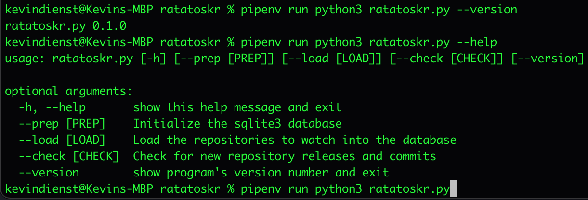
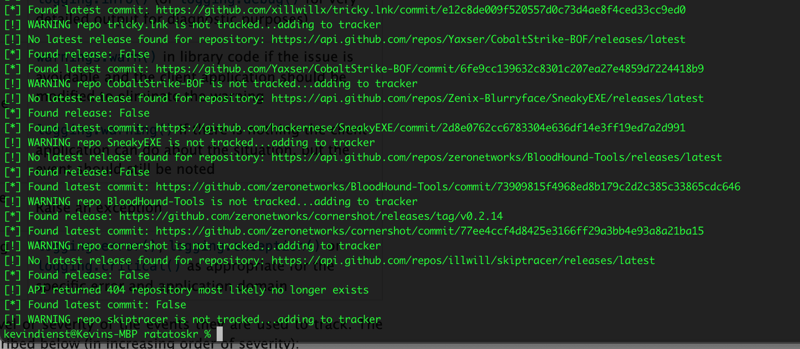
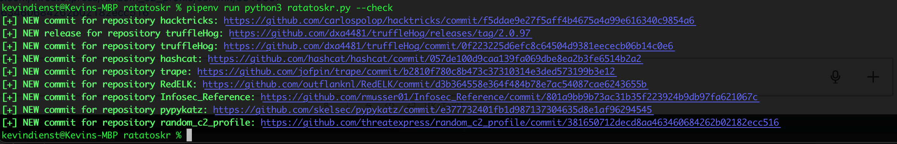
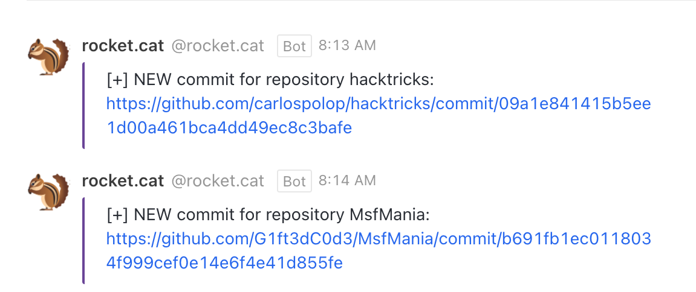

[](https://github.com/axi0m/ratatoskr/blob/main/LICENSE.md)

[](https://github.com/psf/black)
[](https://pyup.io/repos/github/axi0m/ratatoskr/)


# Ratatoskr #


[What is a ratatoskr?](https://en.wikipedia.org/wiki/Ratatoskr)

> This tool is designed to interact with GitHub and GitLab APIs and send webhooks to your chat application in the event that new releases or commits are made to selected repositories of interest.
> Python script with sqlite3 `tracker.db` file that maintains persistent data.

## Features ##

1. Integration with Rocket.Chat, Discord, Microsoft Teams, and Slack via webhooks.
2. Integration with GitHub API.
3. Integration with GitLab API.
4. Supports HTTP Sessions.
5. Automatic commit, rollback and DB connection closure and error handling.
6. Supports tracking latest releases and latest commits in case repository doesn't use releases.
7. Basic Create, Read, and Update support for sqlite3.
8. Per GitHub API - Uses user-agent header specific to tool.
9. Reproducible builds via `Pipfile.lock` file.

## Supported Webhook Receivers ##

| Platform        | Supported |
|-----------------|-----------|
| Slack           | ✅        |
| Discord         | ✅        |
| Microsoft Teams | ✅        |
| Rocket.Chat     | ✅        |

## Install ##

### Clone repository ###

```shell
git clone https://github.com/axi0m/ratatoskr
cd ratatoskr/
```

### Using pipenv ###

```shell
pipenv install
```

### Using requirements.txt ###

```shell
pip install --user requirements.txt
```

## Usage ##

### Environment and Setup ###

  - Minimum Python Version: `3.6`
  - Pipenv Pinned Python Version: `3.9`

1. Ensure `pipenv` is installed, in your path, and you've got a GitHub Personal Access Token and GitLab Personal Access Token exported to environmental variables `GITHUB_TOKEN` and `GITLAB_TOKEN` respectively.
2. Ensure a reference file called `GitHub_Tools_List.csv` is in the current working directory with the URLs of the repositories you want to monitor. Sample is provided here in the repository.
3. Lastly you must export one of the following environment variables depending on your chat application.

   - `ROCKETCHAT_WEBHOOK`
   - `MSTEAMS_WEBHOOK`
   - `SLACK_WEBHOOK`
   - `DISCORD_WEBHOOK`

### Example GitHub_Tools_List.csv ###

```csv
Repo,Category,Currently Used with Approved Aggressor Collection,Added Date
https://github.com/0x09AL/RsaTokenExtractor,.NET Assembly C# Tools,,
https://github.com/0xhexmex/Aggressor-Scripts,aggscripts,,
https://github.com/0xthirteen/CleanRunMRU,.NET Assembly C# Tools,,
https://github.com/0xthirteen/MoveKit,.NET Assembly C# Tools,,
```

### Command-Line Help ###

```shell
pipenv run python3 ratatoskr.py --help
```



### Load repositories ###

1. Create your spreadsheet of GitHub or GitLab URLs to track, if you leave it in Excel format there is a converter script that'll convert to CSV for you, and the wrapper `runner.sh` script is helpful to always run the conversion and then dump the new CSV for use by the script.
2. If an existing `tracker.db` file is not present, it'll automatically create one for you.

```shell
pipenv run python3 ratatoskr.py --load
```



### First Run ###

You will want to have a Personal Access Token for GitHub and GitLab, and the webhook exported to environment variables before attempting to load or run the script.

```shell
export GITHUB_TOKEN='REDACTED'
export GITLAB_TOKEN='REDACTED'
export ROCKETCHAT_WEBHOOK='REDACTED'
pipenv run python3 ratatoskr.py --check
```





### Subsequent Runs ###

Use a scheduler of your choice, cron or systemd-timers on Linux/Unix variants or scheduled tasks in Windows.
There is a `runner.sh` shell script that serves as a template for wrapping this script for use in cron for example.

## References ##

- [Python Requests - Sessions](https://docs.python-requests.org/en/master/user/advanced/#session-objects)
- [Python Standard Library - sqlite3](https://docs.python.org/3/library/sqlite3.html)
- [Using Context Managers with sqlite3](https://docs.python.org/2/library/sqlite3.html#using-the-connection-as-a-context-manager)
- [StackOverflow - Commit and Rollback and With statement](https://stackoverflow.com/questions/19522505/using-sqlite3-in-python-with-with-keyword)
- [StackOverflow - Cursor vs Connection object](https://stackoverflow.com/questions/6318126/why-do-you-need-to-create-a-cursor-when-querying-a-sqlite-database)
- [PyNative - CRUD Operations from Python](https://pynative.com/python-sqlite/#h-perform-sqlite-crud-operations-from-python)
- [GitLab API Docs](https://docs.gitlab.com/ee/api/api_resources.html)
- [Python Requests-HTML - Simple Webscraping](https://docs.python-requests.org/projects/requests-html/en/latest/)
- [Python Pipenv](https://pipenv.pypa.io/en/latest/)
- [Reproducible Builds](https://reproducible-builds.org/)
- [Python Rich - Beautiful CLI](https://github.com/willmcgugan/rich)
- [Webhooks](https://en.wikipedia.org/wiki/Webhook)
